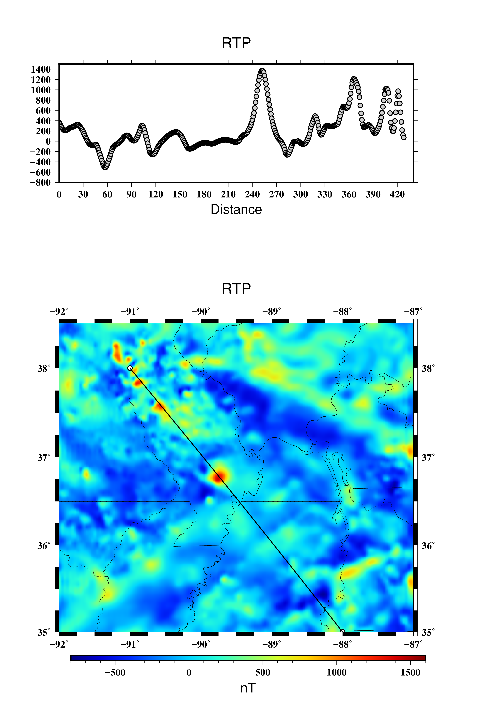

# introduction about files
The file "center.rtf" is to remind myself the location of center. 

The " output_paper_40Mpa_No" is the result from a model with 40Mpa deviatoric stress, no anomaly. 

The " output_paper_40Mpa_5080km" is the result from a model with 50-80km low density anomaly, 40Mpa deviatorc stress in the whole model.

The " output_60Mpa_No" is the result from the model with no anomaly, 60Mpa deviatoric stress.

